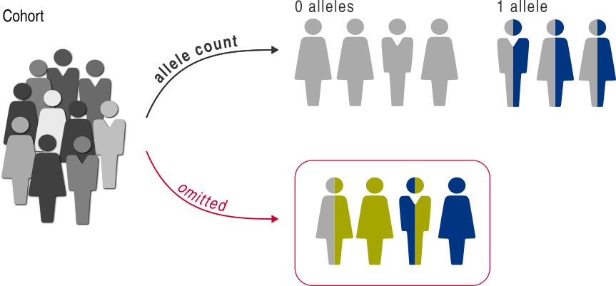
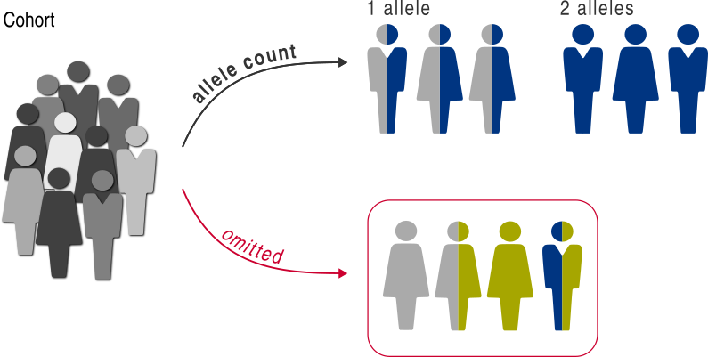

.. _allele-count:

#####################
Group by allele count
#####################

Sometimes, we may want to compare individuals with different allele counts of a single variant category.

For instance, we may want to compare the survival of individuals harboring a mutation in *EGFR* (:math:`AC = 1`)
with those with no such mutation (:math:`AC = 0`). 
Alternatively, in some genes, heterozygous mutations (:math:`AC = 1`) and biallelic mutations (:math:`AC = 2`)
can lead to different diseases.

It is worth pointing out the difference of the allele count analysis
with the variant category analysis described in the :ref:`variant-category` section.
The allele count analysis compares the allele counts while keeping the variant type constant,
whereas the variant category analysis compares variant types while keeping the total allele count constant.

A predicate for the allele count analysis is created with
the :func:`~gpsea.analysis.predicate.genotype.allele_count` function.
The function needs two arguments:
``target`` with a :class:`~gpsea.analysis.predicate.genotype.VariantPredicate` for selecting the target variant type,
and ``counts`` with the target allele counts.
The ``target`` variant predicate typically selects a broad variant types - for instance, all variants that affect a gene of interest.
The ``counts`` take the allele counts to compare.
The inputs are best illustrated on a few examples.

********
Examples
********

Compare the individuals with *EGFR* mutation
============================================

We can use the allele count analysis to test for G/P associations between the individuals with no mutation in *EGFR*
and the individuals harboring 1 variant allele.

First, let's create a :class:`~gpsea.analysis.predicate.genotype.VariantPredicate`
to select variants that affect *EGFR*:

>>> from gpsea.analysis.predicate.genotype import VariantPredicates
>>> affects_egfr = VariantPredicates.gene(symbol="EGFR")
>>> affects_egfr.description
'affects EGFR'

Next, we create allele count predicate to partition the individuals
based on presence of zero or one *EGFR* mutation allele:

>>> from gpsea.analysis.predicate.genotype import allele_count
>>> gt_predicate = allele_count(
...     counts=(0, 1),
...     target=affects_egfr,
... )
>>> gt_predicate.group_labels
('0', '1')

We create the predicate with two arguments.
The ``counts`` argument takes a tuple of the target allele counts,
to partition the individuals based on zero or one allele.
The ``target`` takes a :class:`~gpsea.analysis.predicate.genotype.VariantPredicate`
selecting the target variants. The ``target`` is particularly important
if the cohort members include variants in other genes than *EGFR*.

The resulting ``gt_predicate`` can partition a cohort along the genotype axis,
e.g. to compare the patient survivals in a `survival analysis <survival>`.

Compare the individuals with monoallelic and biallelic mutations
================================================================

As another example, let's partition individuals based on one or two alleles of a target mutation.

For this example, the target mutation is any mutation that affects *LMNA*:

>>> from gpsea.analysis.predicate.genotype import VariantPredicates
>>> affects_lmna = VariantPredicates.gene(symbol="LMNA")
>>> affects_lmna.description
'affects LMNA'

and we will compare the individuals with one allele with those with two alleles:

>>> gt_predicate = allele_count(
...     counts=(1, 2),
...     target=affects_lmna,
... )
>>> gt_predicate.group_labels
('1', '2')

The predicate will partition the individuals into two groups:
those with one *LMNA* variant allele and those with two *LMNA* variant alleles.
The individual with other allele counts (e.g. `0` or `3`) will be excluded
from the analysis.

