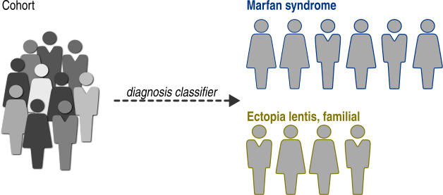

.. _group-by-diagnosis:

==================
Group by diagnosis
==================

We can easily compare individuals diagnosed with different diseases.
:func:`~gpsea.analysis.clf.diagnosis_classifier` groups the individuals
based on a diagnosis presence.

>>> from gpsea.analysis.clf import diagnosis_classifier
>>> gt_clf = diagnosis_classifier(
...     diagnoses=('OMIM:154700', 'OMIM:129600'),
...     labels=('Marfan syndrome', 'Ectopia lentis, familial'),
... )
>>> gt_clf.class_labels
('OMIM:154700', 'OMIM:129600')

The classifier takes two or more disease identifiers (`diagnoses`) as well as their names (`labels`),
and it classifies the individuals based on their diagnoses.

Note, the assignment must be unambiguous; any individual labeled with two or more target diagnoses
(e.g. an individual diagnosed with both *Marfan syndrome* and *Ectopia lentis, familial* in the example above)
will be *omitted* from the analysis.
