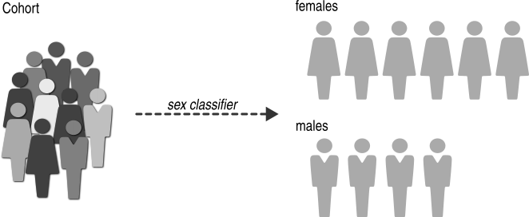

.. _group-by-sex:

============
Group by sex
============

It is easy to investigate the differences between males and females.
The :func:`~gpsea.analysis.clf.sex_classifier` assigns
an individual into a class based on the :class:`~gpsea.model.Sex`:

>>> from gpsea.analysis.clf import sex_classifier
>>> gt_clf = sex_classifier()
>>> gt_clf.class_labels
('FEMALE', 'MALE')

The individuals with :class:`~gpsea.model.Sex.UNKNOWN_SEX` will be omitted from the analysis.

Note that we implemented this classification as a :class:`~gpsea.analysis.clf.GenotypeClassifier`.
Currently, it is not possible to compare the distribution of genotypes across sexes.

