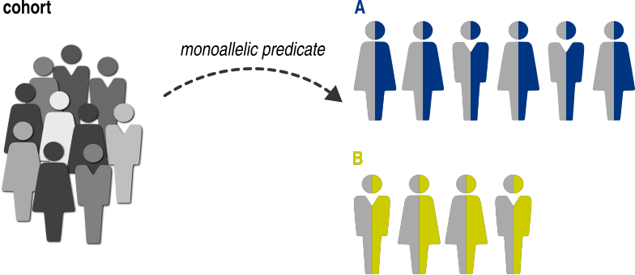

.. _variant-category:

=========================
Group by variant category
=========================

Sometimes we want to compare the individuals who have the same allele count (`AC`) of variant categories :math:`A` and :math:`B`.
For example, in the context of an autosomal dominant disease,
we may want to compare the individuals with :math:`AC_{A}=1` (where :math:`A` is e.g. a predicted loss-of-function mutation)
with those harboring :math:`AC_{B}=1` (where :math:`B` is e.g. a missense mutation).
Similarly, in an autosomal recessive disease, we may be interested in comparing the individuals
with :math:`AC_{A} \ge 1` with those with :math:`AC_{A} = 0`.
In both analyses, we compare two variant categories :math:`A` and :math:`B`
which are described by a :class:`~gpsea.analysis.predicate.genotype.VariantPredicate`
(see :ref:`variant-predicates` section),
while ensuring the allele count sum of both variant categories is :math:`k`.

:math:`k = \sum_{i \in \{A, B\}} AC_{i}`

GPSEA provides two predicates:

.. table::

    +-----------+-----------------------+------------------------------------------------------------------+
    | :math:`k` | Name                  | Function                                                         |
    +===========+=======================+==================================================================+
    | 1         | Monoallelic predicate | :func:`~gpsea.analysis.predicate.genotype.monoallelic_predicate` |
    +-----------+-----------------------+------------------------------------------------------------------+
    | 2         | Biallelic predicate   | :func:`~gpsea.analysis.predicate.genotype.biallelic_predicate`   |
    +-----------+-----------------------+------------------------------------------------------------------+

.. _monoallelic-predicate:

*********************
Monoallelic predicate
*********************

Monoallelic predicate compares the individuals who have *one* allele of a variants of interest.
The predicate needs two variant predicates `A` and `B`
to compute the allele counts :math:`AC_{A}` and :math:`AC_{B}`,
in order to assign an individual into one of the following genotype groups:

.. table:: Monoallelic predicate genotype groups

    +-----------------+-------------------+-------------------+
    | Genotype group  | :math:`AC_{A}`    | :math:`AC_{B}`    |
    +=================+===================+===================+
    | A               | 1                 | 0                 |
    +-----------------+-------------------+-------------------+
    | B               | 0                 | 1                 |
    +-----------------+-------------------+-------------------+
    | ``None``        | other             | other             |
    +-----------------+-------------------+-------------------+

The individuals with :math:`\sum_{i \in \{A, B\}} AC_{i} \neq 1`
are omitted from the analysis.

Example
=======

Let's create a predicate to categorize the individuals
to those having one missense allele or to those having
one frameshift allele with respect to fictional transcript ``NM_1234.5``.

>>> tx_id = "NM_1234.5"

We start by creating the variant predicates for missense (`A`)
and frameshift (`B`) variants:

>>> from gpsea.model import VariantEffect
>>> from gpsea.analysis.predicate.genotype import VariantPredicates
>>> is_missense = VariantPredicates.variant_effect(effect=VariantEffect.MISSENSE_VARIANT, tx_id=tx_id)
>>> is_frameshift = VariantPredicates.variant_effect(effect=VariantEffect.FRAMESHIFT_VARIANT, tx_id=tx_id)

Monoallelic predicate lets us customize the category names.
Let's use `Missense` and `Frameshift` instead of the defaults:

>>> a_label = "Missense"
>>> b_label = "Frameshift"

Now we have all we need to create the predicate:

>>> from gpsea.analysis.predicate.genotype import monoallelic_predicate
>>> gt_predicate = monoallelic_predicate(
...     a_predicate=is_missense,
...     b_predicate=is_frameshift,
...     a_label=a_label, b_label=b_label,
... )
>>> gt_predicate.group_labels
('Missense', 'Frameshift')

.. _biallelic-predicate:

*******************
Biallelic predicate
*******************

Biallelic predicate compares the individuals with *two* alleles of the variants of interest.
The functionality is very similar to that of monoallelic predicate, with two differences.

Categories
==========

Biallelic locus can be present in one of three genotypes, allowing an individual
to be assigned into one of the three genotype groups:

.. _biallelic-predicate-gt-groups:

.. table:: Biallelic predicate genotype groups

    +-------+----------------+-------------------+-------------------+
    | Index | Genotype group | :math:`AC_{A}`    | :math:`AC_{B}`    |
    +=======+================+===================+===================+
    | 0     | A/A            | 2                 | 0                 |
    +-------+----------------+-------------------+-------------------+
    | 1     | A/B            | 1                 | 1                 |
    +-------+----------------+-------------------+-------------------+
    | 2     | B/B            | 0                 | 2                 |
    +-------+----------------+-------------------+-------------------+
    |       | ``None``       | other             | other             |
    +-------+----------------+-------------------+-------------------+

Note that :math:`\sum_{i \in \{A, B\}} AC_{i} = 2` and the individuals
with a different allele count sum are omitted from the analysis.

Example
-------

Let `A` and `B` correspond to *MISSENSE* and *FRAMESHIFT* variants,
and let's reuse the variant predicates ``is_missense`` and ``is_frameshift`` from the previous section,
to compare missense and frameshift variants in the context of an autosomal recessive disease.

>>> from gpsea.analysis.predicate.genotype import biallelic_predicate
>>> gt_predicate = biallelic_predicate(
...     a_predicate=is_missense,
...     b_predicate=is_frameshift,
...     a_label="Missense", b_label="Frameshift",
... )
>>> gt_predicate.group_labels
('Missense/Missense', 'Missense/Frameshift', 'Frameshift/Frameshift')

The predicate will assign the individuals into one of three genotype groups:

* `Missense/Missense` - two missense alleles
* `Missense/Frameshift` - one missense allele and one frameshift allele
* `Frameshift/Frameshift` - two frameshift alleles

    
Partitions
==========

Sometimes we are interested in lumping several genotype groups into a partition
and then comparing the partitions.
For instance, in the context of an autosomal recessive disease,
we may want to compare individuals with two "mild" mutations with the individuals
with at least one "severe" mutation.
This comparison can be implemented using the `partitions` option.

We define a partition as a set of one or more genotype group indices
(see :ref:`biallelic-predicate-gt-groups` table),
and we must provide at least two such partitions to the `partitions` option.

Example
-------

Let `A` and `B` correspond to *MISSENSE* and *FRAMESHIFT* variant
Here we compare the individuals with two missense alleles with the individuals with one frameshift and one missense alleles,
or with two frameshift alelles.

The partition for the two missense alleles will include the genotype group `0`,
and the one or more frameshift alleles partition corresponds to the genotype groups `{1, 2}` (see :ref:`biallelic-predicate-gt-groups` table).
The complete partitions are defined as:

>>> partitions = ({0,}, {1, 2})

We provide `partitions`
to the :func:`~gpsea.analysis.predicate.genotype.biallelic_predicate` function:

>>> gt_predicate = biallelic_predicate(
...     a_predicate=is_missense,
...     b_predicate=is_frameshift,
...     a_label="Missense", b_label="Frameshift",
...     partitions=partitions,
... )
>>> gt_predicate.group_labels
('Missense/Missense', 'Missense/Frameshift OR Frameshift/Frameshift')

Now `gt_predicate` assigns an individual into one of the two categories:

* `Missense/Missense`
* `Missense/Frameshift` OR `Frameshift/Frameshift`
