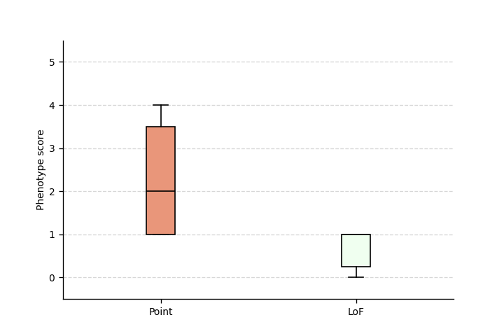

.. _phenotype-score-stats:

########################
Compare phenotype scores
########################

.. doctest::
  :hide:

  >>> from gpsea import _overwrite

In this section, we show how to test for an association between a genotype class and a phenotype score.
We assume a cohort was preprocessed following the :ref:`input-data` section,
and we use a genotype classifier and a phenotype scorer from the :ref:`partitioning` section
to obtain a genotype class and phenotype score for each cohort member.
We use Mann-Whitney U test to test for differences in phenotype score distributions between the classes.

.. _mann-whitney-u-test:

*******************
Mann-Whitney U Test
*******************

We may want to compare the total number of occurences of a specific set of phenotypic features between two different genotype classes.
For instance, `Jordan et al (2018) <https://pubmed.ncbi.nlm.nih.gov/29330883/>`_ found that the total number of structural defects
of the brain, eye, heart, and kidney and sensorineural hearing loss seen in individuals with point mutations in the Atrophin-1 domain of *RERE*
is significantly higher than expected based on the number of similar defects seen in individuals with putative loss-of-function variants.
Since there are five potential defects, each individual has a count ranging between 0 and 5.

We perform a Mann-Whitney U Test (or Wilcoxon Rank-Sum Test) to compare the distribution of such counts between genotype classes.
This is a non-parametric test that compares the medians of the two classes to determine if they come from the same distribution.

>>> import scipy.stats as stats
>>> class1 = [0, 0, 1, 0, 2, 0, 1, 1, 1, 0, 2, 0, 0, 3, 1, 1, 1, 0]
>>> class2 = [4, 5, 3, 4, 3, 3, 3, 4, 4, 5, 5, 2, 3, 0, 3, 5, 2, 3]
>>> r = stats.mannwhitneyu(x=class1, y=class2, alternative = 'two-sided')
>>> p_value = r.pvalue
>>> float(p_value)
6.348081479150...e-06

p value of `6.348081479150e-06` suggests a significant difference between the classes.

****************
Example analysis
****************

Load HPO
========

We will start the analysis with loading HPO `v2024-07-01`:

>>> import hpotk
>>> store = hpotk.configure_ontology_store()
>>> hpo = store.load_minimal_hpo(release='v2024-07-01')
>>> hpo.version
'2024-07-01'

Load cohort
===========

Let's now analyze the subjects reported in *Jordan et al*.
We will load 19 phenopackets that represent individuals with mutations in *RERE*
whose signs and symptoms were encoded into HPO terms and deposited into Phenopacket Store.
We will load the :class:`~gpsea.model.Cohort`
from a `JSON file <https://github.com/P2GX/gpsea/tree/main/docs/cohort-data/RERE.0.1.20.json>`_.
The cohort was prepared from phenopackets as described in :ref:`create-a-cohort` section,
and then serialized as a JSON file following the instructions in :ref:`cohort-persistence` section.

..
   Prepare the JSON file by running the tests in `tests/tests/test_generate_doc_cohorts.py`.

>>> import json
>>> from gpsea.io import GpseaJSONDecoder
>>> fpath_cohort_json = 'docs/cohort-data/RERE.0.1.20.json'
>>> with open(fpath_cohort_json) as fh:
...     cohort = json.load(fh, cls=GpseaJSONDecoder)
>>> len(cohort)
19

Configure analysis
==================

Now we can set up the analysis of genotype and phenotype.
We will perform the analysis using the *RERE* transcript selected
as the "main" biologically relevant by the `MANE` consortium.

>>> tx_id = 'NM_001042681.2'

Genotype predicate
------------------

*Jordan et al.* compare phenotype of individuals harboring point mutations
with the individuals carrying loss of function mutations.
Let's create a predicate for testing if the variant
is a point mutation or a loss of function mutation.

In this example, the point mutation is a mutation that meets the following conditions:

* predicted to lead to a missense variant on the `MANE` transcript
* the :ref:`length-of-the-reference-allele` is equal to `1`
* the :ref:`change-length-of-an-allele` is equal to `0`

>>> from gpsea.model import VariantEffect
>>> from gpsea.analysis.predicate import change_length, ref_length, anyof, variant_effect
>>> point_mutation_effects = (
...     VariantEffect.MISSENSE_VARIANT,
... )
>>> point_mutation = change_length('==', 0) \
...     & ref_length('==', 1) \
...     & anyof(variant_effect(effect, tx_id) for effect in point_mutation_effects)
>>> point_mutation.description
'((change length == 0 AND reference allele length == 1) AND MISSENSE_VARIANT on NM_001042681.2)'

For the loss-of-function predicate, the following is a non-exhausting list
of variant effects considered as a loss-of-function:

>>> lof_effects = (
...     VariantEffect.TRANSCRIPT_TRANSLOCATION,
...     VariantEffect.TRANSCRIPT_ABLATION,
...     VariantEffect.FRAMESHIFT_VARIANT,
...     VariantEffect.START_LOST,
...     VariantEffect.STOP_GAINED,
... )
>>> lof_mutation = anyof(variant_effect(eff, tx_id) for eff in lof_effects)
>>> lof_mutation.description
'(TRANSCRIPT_TRANSLOCATION on NM_001042681.2 OR TRANSCRIPT_ABLATION on NM_001042681.2 OR FRAMESHIFT_VARIANT on NM_001042681.2 OR START_LOST on NM_001042681.2 OR STOP_GAINED on NM_001042681.2)'

The genotype predicate will bin the patient into two classes: a point mutation or the loss of function:

>>> from gpsea.analysis.clf import monoallelic_classifier
>>> gt_clf = monoallelic_classifier(
...     a_predicate=point_mutation,
...     b_predicate=lof_mutation,
...     a_label="Point", b_label="LoF",
... )
>>> gt_clf.class_labels
('Point', 'LoF')

.. _phenotype-score:

Phenotype score
---------------

This component is responsible for computing a phenotype score for an individual.
As far as GPSEA framework is concerned, the phenotype score must be a floating point number
or a `NaN` value if the score cannot be computed for an individual.
This is the essence of the :class:`~gpsea.analysis.pscore.PhenotypeScorer` class.

GPSEA ships with several builtin phenotype scorers which can be used as

+------------------------------------------------------------+---------------------------------------------+
| Name                                                       | Description                                 |
+============================================================+=============================================+
|                                                            | Compute the total number of occurrences     |
| * :class:`~gpsea.analysis.pscore.CountingPhenotypeScorer`  | of specific phenotypic features             |
|                                                            | (used in this section)                      |
+------------------------------------------------------------+---------------------------------------------+
|                                                            | Compute the "adapted De Vries Score"        |
| * :class:`~gpsea.analysis.pscore.DeVriesPhenotypeScorer`   | for assessing severity                      |
|                                                            | of intellectual disability                  |
+------------------------------------------------------------+---------------------------------------------+

.. tip::

   See :ref:`custom-phenotype-scorer` section to learn how to build a phenotype scorer from scratch.

Here we use the :class:`~gpsea.analysis.pscore.CountingPhenotypeScorer` for scoring
the individuals based on the number of structural defects
from the following 5 categories:

* Brain anomalies
* Eye anomalies
* Congenital heart defects
* Renal anomalies
* Sensorineural hearing loss

For example, an individual with a congenital heart defect would be assigned a score of `1`,
an individual with congenital heart defect and a renal anomaly would be assigned a score of `2`,
and so on. If an individual had two heart defects (e.g., atrial septal defect and ventricular septal defect),
a score of 1 (not 2) would be assigned for the heart defect category.

The :class:`~gpsea.analysis.pscore.CountingPhenotypeScorer` automatizes this scoring method
by encoding the categories into HPO terms:

>>> structural_defects = (
...     'HP:0012443',  # Abnormal brain morphology (Brain anomalies)
...     'HP:0012372',  # Abnormal eye morphology (Eye anomalies)
...     'HP:0001627',  # Abnormal heart morphology (Congenital heart defects)
...     'HP:0012210',  # Abnormal renal morphology (Renal anomalies)
...     'HP:0000407',  # Sensorineural hearing impairment (Sensorineural hearing loss)
... )

and then tests the individuals for presence of at least one HPO term
that corresponds to the structural defect
(e.g. `Abnormal brain morphology <https://hpo.jax.org/browse/term/HP:0012443>`_, exact match)
or that is its descendant
(e.g. `Cerebellar atrophy <https://hpo.jax.org/browse/term/HP:0001272>`_).

We construct the scorer with
:func:`~gpsea.analysis.pscore.CountingPhenotypeScorer.from_query_curies` function:

>>> from gpsea.analysis.pscore import CountingPhenotypeScorer
>>> pheno_scorer = CountingPhenotypeScorer.from_query_curies(
...     hpo=hpo,
...     query=structural_defects,
... )
>>> pheno_scorer.description
'Assign a phenotype score that is equivalent to the count of present phenotypes that are either an exact match to the query terms or their descendants'

Statistical test
----------------

We will use :ref:`mann-whitney-u-test` to test for differences between scores
of the different genotype groups

>>> from gpsea.analysis.pscore.stats import MannWhitneyStatistic
>>> score_statistic = MannWhitneyStatistic()

.. tip::

   See :mod:`gpsea.analysis.pscore.stats` module for more statistical tests available
   for using with phenotype scores.

Final analysis
--------------

We will put the final analysis together into :class:`~gpsea.analysis.pscore.PhenotypeScoreAnalysis`.

>>> from gpsea.analysis.pscore import PhenotypeScoreAnalysis
>>> score_analysis = PhenotypeScoreAnalysis(
...     score_statistic=score_statistic,
... )

Analysis
========

We execute the analysis by running

>>> result = score_analysis.compare_genotype_vs_phenotype_score(
...     cohort=cohort,
...     gt_clf=gt_clf,
...     pheno_scorer=pheno_scorer,
... )

In case of the *RERE* cohort, the analysis shows a significant difference
between the number of structural defects in individuals
with point vs. loss-of-function mutations.

>>> result.pval # doctest: +ELLIPSIS
0.0120749576...

To explore further, we can access a data frame with genotype categories and phenotype counts:

>>> scores = result.data.sort_index()
>>> scores.head()  # doctest: +NORMALIZE_WHITESPACE
                                      genotype  phenotype
patient_id
Subject 10[PMID_27087320_Subject_10]         1          0
Subject 1[PMID_27087320_Subject_1]           0          4
Subject 1[PMID_29330883_Subject_1]           1          0
Subject 2[PMID_27087320_Subject_2]        None          4
Subject 2[PMID_29330883_Subject_2]           1          1

The data frame provides a `genotype` category and a `phenotype_score` for each patient.
The genotype category should be interpreted in the context of the genotype predicate:

>>> gt_id_to_name = {c.category.cat_id: c.category.name for c in gt_clf.get_categorizations()}
>>> gt_id_to_name
{0: 'Point', 1: 'LoF'}

The genotype code `0` is assigned to patients with a point mutation, `1` corresponds to the loss-of-function mutations,
and `None` is assigned to patients who cannot be assigned into any of the groups.

Last, let's use :meth:`~gpsea.analysis.pscore.PhenotypeScoreAnalysisResult.plot_boxplots` method
to visualize the phenotype score distributions:

>>> import matplotlib.pyplot as plt
>>> fig, ax = plt.subplots(figsize=(6, 4), dpi=120)
>>> result.plot_boxplots(
...     ax=ax,
... )
>>> _ = ax.grid(axis="y")
>>> _ = ax.set(
...     ylabel="Phenotype score", ylim=(-0.5, len(structural_defects) + 0.5)
... )

.. doctest:: phenotype-scores
   :hide:

   >>> if _overwrite: fig.savefig('docs/user-guide/analyses/report/rere_phenotype_score_boxplot.png')

We see that the individuals with the point mutations feature structural defects
than the individuals with the loss-of-function mutations.

The box extends from the first quartile (Q1) to the third quartile (Q3) of the data,
with a red line at the median.
The whiskers extend from the box to the farthest data point
lying within 1.5x the inter-quartile range (IQR) from the box.
