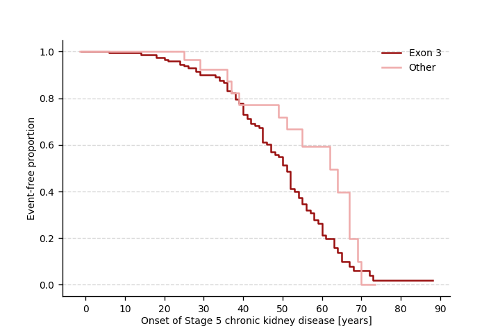

.. _survival:

=================
Survival analysis
=================

.. doctest::
  :hide:

  >>> from gpsea import _overwrite

****************
Example analysis
****************

We will analyze the time until end stage renal disease in 207 individuals with mutations in *UMOD*.
Specifically, we will test for difference between the onset of the end stage renal disease in the individuals with mutation
in exon 3 of *UMOD* vs. individuals with other *UMOD* mutation.

Load cohort
===========

For the purpose of this analysis, we will load the :class:`~gpsea.model.Cohort`
from a `JSON file <https://github.com/P2GX/gpsea/tree/main/docs/cohort-data/UMOD.0.1.20.json>`_.
The cohort was prepared from phenopackets as described in :ref:`create-a-cohort` section,
and then serialized as a JSON file following the instructions in :ref:`cohort-persistence` section.

..
   Prepare the JSON file by running the tests in `tests/tests/test_generate_doc_cohorts.py`.

>>> import json
>>> from gpsea.io import GpseaJSONDecoder
>>> fpath_cohort_json = 'docs/cohort-data/UMOD.0.1.20.json'
>>> with open(fpath_cohort_json) as fh:
...     cohort = json.load(fh, cls=GpseaJSONDecoder)
>>> len(cohort)
207

Configure analysis
==================

*MANE* transcript of *UMOD*.

>>> tx_id = 'NM_003361.4'

Genotype classifier
-------------------

One allele of exon 3 vs. one allele of elsewhere.

>>> from gpsea.analysis.predicate import exon
>>> is_in_exon3 = exon(exon=3, tx_id=tx_id)
>>> is_in_exon3.description
'overlaps with exon 3 of NM_003361.4'

Monoallelic classifier to compare one allele of *UMOD* exon 3 variant
versus one allele of other *UMOD* variant:

>>> from gpsea.analysis.clf import monoallelic_classifier
>>> gt_clf = monoallelic_classifier(
...     a_predicate=is_in_exon3,
...     b_predicate=~is_in_exon3,
...     a_label="Exon 3", b_label="Other",
... )
>>> gt_clf.class_labels
('Exon 3', 'Other')

Survival endpoint
-----------------

The endpoint of our study is defined as development of end stage renal disease.
In the *UMOD* cohort, this is encoded with
`Stage 5 chronic kidney disease <https://hpo.jax.org/browse/term/HP:0003774>`_
(`HP:0003774`) HPO term.
We need to leverage the HPO hierarchy when computing
the onset of an HPO term. Let's load HPO:

>>> import hpotk
>>> store = hpotk.configure_ontology_store()
>>> hpo = store.load_minimal_hpo(release='v2024-07-01')

and now we can create an :class:`~gpsea.analysis.temporal.Endpoint`
to compute the time until an individual develops end stage renal disease:

>>> from gpsea.analysis.temporal.endpoint import hpo_onset
>>> term_id = "HP:0003774"  # Stage 5 chronic kidney disease
>>> endpoint = hpo_onset(hpo=hpo, term_id=term_id)
>>> endpoint.description
'Compute time until onset of Stage 5 chronic kidney disease'

Statistical test
----------------

We will use Log rank test to compare the age until the endpoint between
the genotype groups:

>>> from gpsea.analysis.temporal.stats import LogRankTest
>>> survival_statistic = LogRankTest()

Final analysis
--------------

We will put the final analysis together into a :class:`~gpsea.analysis.temporal.SurvivalAnalysis`.

>>> from gpsea.analysis.temporal import SurvivalAnalysis
>>> survival_analysis = SurvivalAnalysis(
...     statistic=survival_statistic,
... )

Analysis
========

We execute the analysis by running

>>> result = survival_analysis.compare_genotype_vs_survival(
...     cohort=cohort,
...     gt_clf=gt_clf,
...     endpoint=endpoint,
... )

>>> result.pval
0.062004258300...

Kaplan-Meier curves
-------------------

We can plot Kaplan-Meier curves:

>>> from gpsea.model import Age
>>> import matplotlib as mpl
>>> import matplotlib.pyplot as plt
>>> fig, ax = plt.subplots(figsize=(6, 4), dpi=120)
>>> result.plot_kaplan_meier_curves(
...     ax=ax,
... )
>>> _ = ax.xaxis.set(
...     # Show X axis in years ...
...     major_formatter=mpl.ticker.FuncFormatter(lambda x, pos: f"{x / Age.DAYS_IN_YEAR:.0f}"),
...     # ... with a tick for every decade
...     major_locator=mpl.ticker.MultipleLocator(10 * Age.DAYS_IN_YEAR),
... )
>>> _ = ax.set(
...     xlabel=endpoint.name + " [years]",
...     ylabel="Event-free proportion",
... )
>>> _ = ax.grid(axis="y")

.. doctest:: survival
   :hide:

   >>> if _overwrite: fig.savefig('docs/user-guide/analyses/report/umod_km_curves.png')

Raw data
--------

The `result` includes the survival values for all cohort members:

>>> survivals = result.data.sort_index()
>>> survivals.head()  # doctest: +NORMALIZE_WHITESPACE
                          genotype    phenotype
patient_id
AII.1[PMID_22034507_AII_1]       0    Survival(value=18262.5, is_censored=True)
AII.2[PMID_22034507_AII_2]       0    None
AII.3[PMID_22034507_AII_3]       0    Survival(value=16436.25, is_censored=True)
AII.5[PMID_22034507_AII_5]       0    Survival(value=22280.25, is_censored=False)
AIII.4[PMID_22034507_AIII_4]     0    Survival(value=19723.5, is_censored=False)

Each line corresponeds to an individual and the dataframe is indexed by the individual's identifier/label.
The `genotype` column contains the genotype class code,
and `phenotype` column includes a :class:`~gpsea.analysis.temporal.Survival` value
or `None` if computing the survival was impossible (see :func:`~gpsea.analysis.temporal.endpoint.hpo_onset` for details).
The `Survival` reports the number of days until attaining the endpoint,
here defined as end stage renal disease (`is_censored=False`),
or until the individual dropped out of the analysis (`is_censored=True`).

Troubleshooting
===============

Sometimes the survival analysis fails and an :class:`~gpsea.analysis.AnalysisException` is raised.
For instance, the current Logrank test implementation reports a p value of `NaN`
if the survival is the same for all individuals.
This is unlikely an expected outcome, therefore GPSEA raises
an :class:`~gpsea.analysis.AnalysisException` to force the user to troubleshoot.

To help with troubleshooting, the data computed prior detecting the error is included in the exception's
:attr:`~gpsea.analysis.AnalysisException.data` attribute. In survival analysis, the data should include
the identifiers, genotype classes, and survivals of the tested individuals.

Let's show this on an example. We will create a toy cohort of 10 individuals
with onset of `Lynch syndrome I <https://hpo.jax.org/browse/disease/OMIM:120435>`_
(`OMIM:120435`) at 40 years.

>>> from gpsea.model import Cohort, Patient, Disease, Age
>>> onset = Age.from_iso8601_period("P40Y")
>>> individuals = [
...     Patient.from_raw_parts(
...         labels=label,
...         diseases=(
...             Disease.from_raw_parts(
...                 term_id="OMIM:120435",
...                 name="Lynch syndrome I",
...                 is_observed=True,
...                 onset=onset,
...             ),
...         ),
...     )
...     for label in "ABCDEFGHIJ"  # 10 individuals
... ]
>>> cohort = Cohort.from_patients(individuals)

We will assign them into genotype classes on random, ...

>>> from gpsea.analysis.clf import random_classifier
>>> gt_clf = random_classifier(seed=123)
>>> gt_clf.description
'Classify the individual into random classes'

... using the Lynch syndrome I diagnosis as the endpoint ...

>>> from gpsea.analysis.temporal.endpoint import disease_onset
>>> endpoint = disease_onset(disease_id="OMIM:120435")
>>> endpoint.description
'Compute time until OMIM:120435 onset'

... and we will use Logrank test for differences in survival.

>>> from gpsea.analysis.temporal.stats import LogRankTest
>>> survival_statistic = LogRankTest()

We put together the survival analysis ...

>>> from gpsea.analysis.temporal import SurvivalAnalysis
>>> survival_analysis = SurvivalAnalysis(
...     statistic=survival_statistic,
... )

... which we expect to fail with an :class:`~gpsea.analysis.AnalysisException`:

>>> result = survival_analysis.compare_genotype_vs_survival(
...     cohort=cohort,
...     gt_clf=gt_clf,
...     endpoint=endpoint,
... )
Traceback (most recent call last):
  ...
gpsea.analysis._base.AnalysisException: The survival values did not meet the expectation of the statistical test!

The genotype classes and survival values can be retrieved from the exception:

>>> from gpsea.analysis import AnalysisException
>>> try:
...     result = survival_analysis.compare_genotype_vs_survival(
...         cohort=cohort,
...         gt_clf=gt_clf,
...         endpoint=endpoint,
...     )
... except AnalysisException as ae:
...     genotypes = ae.data["genotype"]
...     survivals = ae.data["survival"]

and the values can come in handy in troubleshooting:

>>> genotypes[:3]
(0, 0, 0)
>>> survivals[:3]
(Survival(value=14610.0, is_censored=False), Survival(value=14610.0, is_censored=False), Survival(value=14610.0, is_censored=False))
