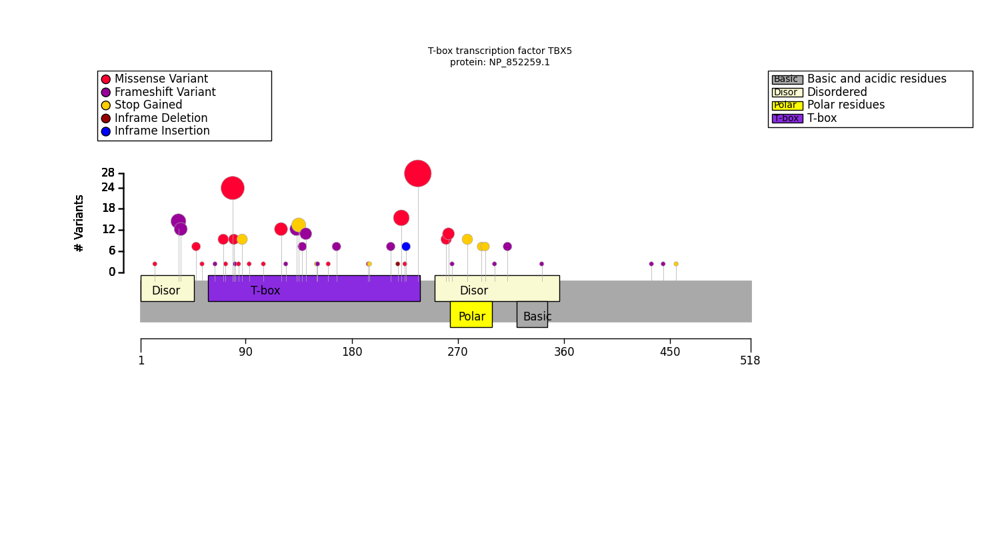

.. _exploratory:

===========================
Cohort exploratory analysis
===========================

.. doctest::
  :hide:

  >>> from gpsea import _overwrite

**********
Background
**********

As a general rule for statistical testing, it is preferable to formulate one or several hypotheses and to test
these in a targeted way. Performing numerous tests without any specific plan comes with an increased
danger of false-positive results (although it may be appropriate to generate hypotheses if a validation cohort is
available).

Types of statistical tests
--------------------------

GPSEA offers four statistical tests:

- Fisher Exact Test (FET): Association between two categorical variables.
  In this case, the first categorical variable is presence/absense of a genotype and the second is presence/absense of annotation to an HPO term.
- Mann Whitney U test: Association between presence/absence of a genotype with a phenotype score (e.g., :ref:`devries-scorer`).
- t test: Association between presence/absence of a genotype with a numerical test result (e.g., potassium level).
- log rank test: Association between presence/absence of a genotype with age-of-onset of a disease or of an HPO feature or with mortality.

Please consult the documentation pages for each of these tests if you are unsure which to use.

Power
-----

Two things must be true to identify a valid genotype-phenotype correlation. First, and obviously,
the correlation must actually exist in the dataset being analyzed. Second, there must be statistical power to
identify the effect.
Power is a measure of the ability of an experimental design and hypothesis testing setup to detect a
particular effect if it is truly present (`Wikipedia <https://en.wikipedia.org/wiki/Power_(statistics)>`_).

It will generally not be possible to perform a formal power calculation because the effect size of
most genotype-phenotype correlations is not well known. But, for instance it would not
make much sense to test for correlation with a specific variant that occurs in only one of 50 individuals in a cohort.

***********
Exploration
***********

The purpose of the exploratory analysis is thus to decide which tests to perform.
GPSEA provides tables and graphics that visualize some of the salient aspects
of the cohort and the distribution of the identified variants.
We exemplify the exploratory analysis on a cohort of 156 individuals with mutations
in *TBX5* from Phenopacket Store *0.1.20*. The cohort was preprocessed as described
in the :ref:`input-data` section and stored
at `docs/cohort-data/TBX5.0.1.20.json <https://github.com/P2GX/gpsea/tree/main/docs/cohort-data/TBX5.0.1.20.json>`_
in JSON format.

We start by loading the cohort from the JSON file:

>>> import json
>>> from gpsea.io import GpseaJSONDecoder
>>> fpath_cohort = 'docs/cohort-data/TBX5.0.1.20.json'
>>> with open(fpath_cohort) as fh:
...     cohort = json.load(fh, cls=GpseaJSONDecoder)
>>> len(cohort)
156

Then we choose the transcript and protein identifiers, and we fetch the corresponding data:
(see :ref:`choose-tx-and-protein` for more info):

>>> from gpsea.preprocessing import configure_default_tx_coordinate_service, configure_default_protein_metadata_service
>>> tx_id = "NM_181486.4"
>>> px_id = "NP_852259.1"
>>> tx_service = configure_default_tx_coordinate_service(genome_build="GRCh38.p13")
>>> tx_coordinates = tx_service.fetch(tx_id)
>>> pm_service = configure_default_protein_metadata_service()
>>> protein_meta = pm_service.annotate(px_id)

Last, we load HPO `v2024-07-01` to use in the exploratory analysis:

>>> import hpotk
>>> store = hpotk.configure_ontology_store()
>>> hpo = store.load_minimal_hpo(release='v2024-07-01')

Interactive exploration
-----------------------

The code for generating reports with tables and figures is located in :mod:`gpsea.view` module.
As a rule of thumb, the reports leverage IPython's "magic"
to integrate with the environments such as Jupyter notebook.
Returning the report object as the last cell expression will render the report in the cell output.

Cohort summary
--------------

We recommend that users start be generating a cohort summary
with an overview about the HPO terms, variants, diseases, and variant effects that occur most frequently.
We create the `viewer` and we generate the `report` for a cohort and transcript.
The implicit return of the `report` at the end of the cell renders the report in the cell output:

>>> from gpsea.view import CohortViewer
>>> viewer = CohortViewer(hpo)
>>> report = viewer.process(cohort=cohort, transcript_id=tx_id)
>>> report  # doctest: +SKIP

.. raw:: html
  :file: reports/tbx5_cohort_info.html

.. doctest:: exploratory
    :hide:

    >>> if _overwrite: report.write('docs/user-guide/reports/tbx5_cohort_info.html')

Distribution of variants across protein domains
-----------------------------------------------

GPSEA gathers information about protein domains from the UniProt API, and alternatively allows users to
enter domain information manually (See :ref:`fetch-protein-data`).
Protein domains are distinct functional or structural units in a protein. For instance, the following graphic shows domains of
the *PLD1* protein. The HKD domains contribute to the catalytic activity of the protein whereas the PX and PH domains
regulation PLD1 localization within the cell. Observations such as this may suggest testable hypotheses.

   Human *PLD1* with PX, PH, and two HKD domains.

Users can create a table to display the protein domains and the variants
located in them in order to decide whether it might be sensible to test for correlation between variants
located in one or more protein domains and a certain phenotype.

This code will produce the following table on the basis of a cohort of individuals
with variants in the *TBX5* gene:

>>> from gpsea.view import ProteinVariantViewer
>>> cpd_viewer = ProteinVariantViewer(protein_metadata=protein_meta, tx_id=tx_id)
>>> report = cpd_viewer.process(cohort)
>>> report  # doctest: +SKIP

.. raw:: html
  :file: reports/tbx5_protein_info.html

.. doctest:: exploratory
    :hide:

    >>> if _overwrite: report.write('docs/user-guide/reports/tbx5_protein_info.html')

Plot distribution of variants with respect to the protein sequence
------------------------------------------------------------------

Cohort artist
^^^^^^^^^^^^^

The simplest way to plot the variant distribution is to use the :class:`~gpsea.view.CohortArtist` API:

>>> import matplotlib.pyplot as plt
>>> from gpsea.view import configure_default_cohort_artist
>>> cohort_artist = configure_default_cohort_artist()
>>> fig, ax = plt.subplots(figsize=(15, 8))
>>> cohort_artist.draw_protein(
...     cohort=cohort,
...     protein_id=px_id,
...     ax=ax,
... )

.. image:: img/TBX5_protein_diagram.from_artist.png
   :alt: TBX5 protein diagram
   :align: center
   :width: 600px

.. doctest:: exploratory
    :hide:

    >>> if _overwrite:
    ...     fig.tight_layout()
    ...     fig.savefig('docs/user-guide/img/TBX5_protein_diagram.from_artist.png')

The :func:`~gpsea.view.configure_default_cohort_artist` function gets the default artist
which we use to plot the diagram with the variant distribution across the protein sequence
on Matplotlib axes.

Protein visualizer
^^^^^^^^^^^^^^^^^^

Sometimes, however, things do not work out-of-the-box, e.g. because protein metadata
is not available from Uniprot (the default), and we may need to use the lower-level components.

The :class:`~gpsea.view.ProteinVisualizer` takes cohort and the protein metadata
to plot the distribution of variants on a protein diagram:

>>> from gpsea.view import ProteinVisualizer
>>> fig, ax = plt.subplots(figsize=(15, 8))
>>> visualizer = ProteinVisualizer()
>>> visualizer.draw_protein(
...     cohort=cohort,
...     protein_metadata=protein_meta,
...     ax=ax,
... )

.. doctest:: exploratory
    :hide:

    >>> if _overwrite:
    ...     fig.tight_layout()
    ...     fig.savefig('docs/user-guide/img/TBX5_protein_diagram.from_protein_visualizer.png')
