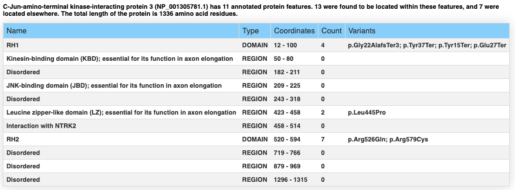

.. _exploratory:

===========================
Cohort exploratory analysis
===========================

As a general rule for statistical testing, it is preferable to formulate one or several hypotheses and to test
these in a targeted way. Performing numerous tests without any specific plan comes with an increased
danger of false-positive results (although it many be appropriate to generate hypotheses if a validation cohort is
available).

Types of statistical test
^^^^^^^^^^^^^^^^^^^^^^^^^

GPSEA offers four statistical tests.

- Fisher Exact Test (FET): Association between two categorical variables. In this case, the first categorical variable is presence/absense of a genotype and the second is presence/absense of annotation to an HPO term.
- Mann Whitney U test: Association between presence/absence of a genotype with a phenotype score (e.g., :ref:`devries`).
- t test: Association between presence/absence of a genotype with a numerical test result (e.g., potassium level)
- log rank score: Association between presence/absence of a genotype with age-of-onset of disease or of an HPO feature or with mortality

Please consult the documentation pages for each of these tests if you are unsure which to use.

Power
^^^^^
Two things must be true to identify a valid genotype-phenotype correlation. First, and obviously,
the correlation must actually exist in the dataset being analyzed. Second, there must be statistical power to
identify the effect.
Power is a measure of the ability of an experimental design and hypothesis testing setup to detect a
particular effect if it is truly present (`Wikipedia <https://en.wikipedia.org/wiki/Power_(statistics)>`_).

It will generally not be possible to perform a formal power calculation because the effect size of
most genotype-phenotype correlations is not well known. But, for instance it would not
make much sense to test for correlation with a specific variant that occurs in only one of 50 individuals in a cohort.

Exploration
===========

The purpose of the exploratory analysis is thus to decide which tests to perform. GPSEA provides tables and graphics
that visualize some of the salient aspects of the cohort and the distribution of the identified variants.

We recommend that users start be generating a cohort summary (see :ref:`tutorial` for a fuller example). ::

    from gpsea.view import CohortViewable
    viewer = CohortViewable(hpo)
    report = viewer.process(cohort=cohort, transcript_id=tx_id)
    from IPython.display import HTML, display
    display(HTML(report))

See also on the tutorial page code for viewing the distribution of variants on the protein structure and for
generating a table with all identified variants. The following text presents some additional functionality for
creating exploratory tables and graphics.

Distribution of variants across protein domains
^^^^^^^^^^^^^^^^^^^^^^^^^^^^^^^^^^^^^^^^^^^^^^^

GPSEA gathers information about protein domains from the UniProt API, and alternatively allows users to
enter domain information manually (See :ref:`fetch-protein-data`).
Protein domains are  distinct functional or structural units in a protein. For instance, the following graphic shows domains of
the PLD1 protein. The HKD domains contribute to the catalytic activity of the protein whereas the PX and PH domains
regulation PLD1 localization within the cell. Observations such as this may suggest testable hypotheses.

.. figure:: ./img/PLD1a.png
   :alt: PLD1a
   :align: center
   :width: 600px

   Human PLD1a with PX, PH, and two HKD domains.

Users can create a table to
display the protein domains and the variants located in them in order to decide whether it might be
sensible to test for correlation between variants located in one or more protein domains and a certain phenotype. ::

    from gpsea.view import ProteinVariantViewer
    from gpsea.preprocessing import configure_default_protein_metadata_service
    pms = configure_default_protein_metadata_service()
    protein_meta = pms.annotate(mane_protein_id)
    cpd_viewer = ProteinVariantViewer(tx_id=mane_tx_id, protein_metadata=protein_meta)

This code will produce the following table on the basis of a cohort of individuals
with variants in the MAPK8IP3 gene.

   Distrivution of MAPK8IP3 variants across the domains of the protein.
