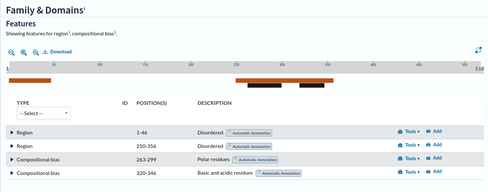
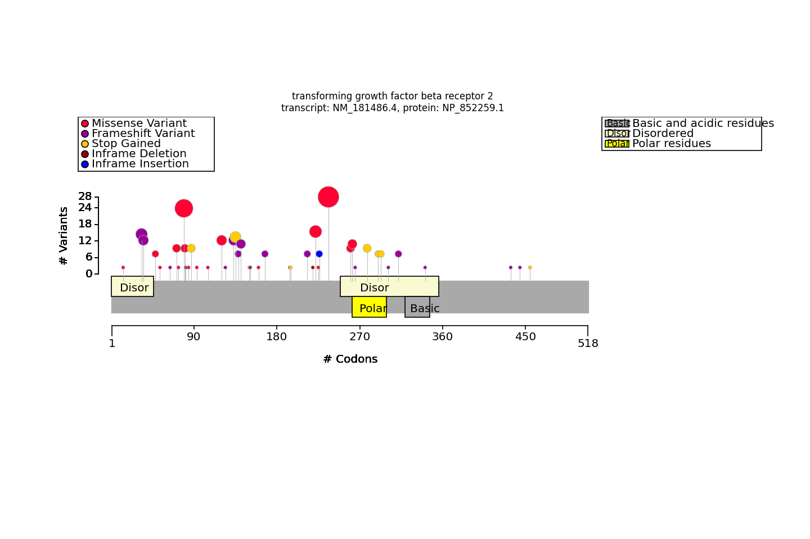

.. _input-data:

==========
Input data
==========

The genotype-phenotype association analyses are carried out with a standardized form of genotype and phenotype data.
All analyses need an instance of :class:`~gpsea.model.Cohort` that consists
of individuals in form of a :class:`~gpsea.model.Patient` class.
On top of the cohort, an information about the transcript and protein sequence of the target gene(s)
may be needed for most analyses types.
Here we show how to standardize genotype and phenotype data,
and how to prepare the transcript and protein information for the subsequent analyses.

***************************************
Standardize genotype and phenotype data
***************************************

The first step of the `gpsea` analysis involves standardization of the genotype and phenotype data
and performing functional annotation of the variants.

Create a cohort from GA4GH phenopackets
---------------------------------------

The easiest way to input data into `gpsea` is to use the
`GA4GH Phenopacket Schema <https://phenopacket-schema.readthedocs.io/en/latest>`_ phenopackets.
`gpsea` provides an out-of-the-box solution for loading a cohort from a folder of phenopacket JSON files.

Configure a cohort creator
^^^^^^^^^^^^^^^^^^^^^^^^^^

Next, let's prepare a :class:`~gpsea.preprocessing.CohortCreator` that will turn a phenopacket collection
into a :class:`~gpsea.model.Cohort`. The cohort creator also performs an input validation.
The validation needs Human Phenotype Ontology data.
Let's start with loading Human Phenotype Ontology, a requisite for the input Q/C steps. We'll use the amazing
`hpo-toolkit <https://github.com/TheJacksonLaboratory/hpo-toolkit>`_ library which is installed along with
the standard `gpsea` installation:

>>> import hpotk
>>> store = hpotk.configure_ontology_store()
>>> hpo = store.load_minimal_hpo(release='v2024-07-01')

The easiest way to get the `CohortCreator` is to use the
:func:`~gpsea.preprocessing.configure_caching_cohort_creator` convenience method:

.. doctest:: input-data 

  >>> from gpsea.preprocessing import configure_caching_cohort_creator

  >>> cohort_creator = configure_caching_cohort_creator(hpo) 

.. note::

  The default `CohortCreator` will call Variant Effect Predictor and Uniprot APIs
  to perform the functional annotation and protein annotation, 
  and the responses will be cached in the current working directory to reduce the network bandwidth.
  See the :func:`~gpsea.preprocessing.configure_caching_cohort_creator` pydoc for more options.

Load phenopackets
^^^^^^^^^^^^^^^^^

We can create a cohort starting from a collection of `Phenopacket` objects
provided by Python  `Phenopackets <https://pypi.org/project/phenopackets>`_ library.
For the purpose of this example, we will load a cohort of patients with pathogenic mutations in *RERE* gene
included in the release `0.1.18` of `Phenopacket Store <https://github.com/monarch-initiative/phenopacket-store>`_.
We use `Phenopacket Store Toolkit <https://github.com/monarch-initiative/phenopacket-store-toolkit>`_
(``ppktstore`` in the code) to reduce the boilerplate code needed to load the phenopackets:

>>> from ppktstore.registry import configure_phenopacket_registry
>>> registry = configure_phenopacket_registry()
>>> with registry.open_phenopacket_store(release="0.1.19") as ps:
...     phenopackets = tuple(ps.iter_cohort_phenopackets('RERE'))
>>> len(phenopackets)
19

We loaded 19 phenopackets. Now we can turn the phenopackets into a `Cohort`
using the `cohort_creator` and the :func:`~gpsea.preprocessing.load_phenopackets`
loader function:

>>> from gpsea.preprocessing import load_phenopackets
>>> cohort, qc_results = load_phenopackets(phenopackets, cohort_creator)  # doctest: +ELLIPSIS, +NORMALIZE_WHITESPACE
Individuals Processed: ...
>>> len(cohort)
19

The cohort includes all 19 individuals. 

Alternative phenopacket sources
^^^^^^^^^^^^^^^^^^^^^^^^^^^^^^^

In case you do not already have a `Phenopacket` collection at your fingertips,
GPSEA provides a few other convenience functions for loading phenopackets from JSON files.

The :func:`~gpsea.preprocessing.load_phenopacket_files` function loads
phenopackets from one or more paths that point to phenopacket JSON files:

>>> from gpsea.preprocessing import load_phenopacket_files
>>> pp_file_paths = ('path/to/phenopacket1.json', 'path/to/phenopacket2.json')
>>> cohort, qc_results = load_phenopacket_files(pp_file_paths, cohort_creator)  # doctest: +SKIP

Alternatively, you can load an entire directory of phenopackets
with the :func:`~gpsea.preprocessing.load_phenopacket_folder` loader function.
The function expects a `str` with path to a directory that contains one or more phenopackets
stored as JSON files. The loader includes all files that end with ``*.json`` suffix
and ignores any other files or sub-directories:

>>> from gpsea.preprocessing import load_phenopacket_folder
>>> pp_dir = 'path/to/folder/with/many/phenopacket/json/files'
>>> cohort, qc_results = load_phenopacket_folder(pp_dir, cohort_creator)  # doctest: +SKIP

.. _quality-control:

Quality control
^^^^^^^^^^^^^^^

Besides the :class:`~gpsea.model.Cohort`, the loader functions also provide Q/C results (``qc_results``)
as :class:`~gpsea.preprocessing.PreprocessingValidationResult`.
The Q/C checker points out as many issues as possible (not just the first one),
to allow fixing all issues at once. 
The issues can be explored programmaticaly
through the :class:`~gpsea.preprocessing.PreprocessingValidationResult` API,
or we can display a summary with the
:meth:`~gpsea.preprocessing.PreprocessingValidationResult.summarize` method:

>>> qc_results.summarize()  # doctest: +SKIP
Validated under permissive policy
No errors or warnings were found

In this case, no Q/C issues were found.

.. _cohort-persistence:

****************************
Persist the cohort for later
****************************

The preprocessing of a cohort can take some time even if we cache the responses from remote resources,
such as Variant Effect Predictor, Variant Validator, or Uniprot.
GPSEA ships with a custom encoder and decoder
designed to be integrated with Python's built-in :mod:`json` module to 
persist a :class:`~gpsea.model.Cohort` to a JSON file and load it back.

Example
-------

We can dump the :class:`~gpsea.model.Cohort` into JSON
by providing :class:`~gpsea.io.GpseaJSONEncoder` via `cls` option to the `json` module functions,
such as the :func:`json.dumps` which encodes an object into a JSON `str`:

>>> import json
>>> from gpsea.io import GpseaJSONEncoder
>>> encoded = json.dumps(cohort, cls=GpseaJSONEncoder)
>>> encoded[:80]
'{"members": [{"labels": {"label": "Subject 8", "meta_label": "PMID_29330883_Subj'

Here we see the first 80 letters of the JSON object.

We can decode the JSON object with :class:`~gpsea.io.GpseaJSONDecoder` to get the same cohort back:

>>> from gpsea.io import GpseaJSONDecoder
>>> decoded = json.loads(encoded, cls=GpseaJSONDecoder)
>>> cohort == decoded
True

We will leave persisting the cohort into an actual file or another data store as an exercise for the interested readers.

***************************************************
Get data for the transcript and protein of interest
***************************************************

Choose the transcript
---------------------

For the analysis, the `MANE <https://www.ncbi.nlm.nih.gov/refseq/MANE/>`_ transcript
(i.e., the "main" biomedically relevant transcript of a gene) should be chosen unless
there is a specific reason not to (which should occur rarely if at all).

A good way to find the MANE transcript is to search on the gene symbol (e.g., *TBX5*) in `ClinVar <https://www.ncbi.nlm.nih.gov/clinvar/>`_ and to
choose a variant that is specifically located in the gene. The MANE transcript will be displayed here (e.g., `NM_181486.4(TBX5):c.1221C>G (p.Tyr407Ter)
<https://www.ncbi.nlm.nih.gov/clinvar/variation/495227/>`_).
The RefSeq identifier of the encoded protein (e.g. `NP_852259.1` for *TBX5*) should be also readily available on the ClinVar website:

>>> mane_tx_id = "NM_181486.4"
>>> mane_pt_id = "NP_852259.1"

Get the transcript data
-----------------------

Besides the transcript accession ID, the downstream analysis may need more information
about the "anatomy" of the transcript of interest, such as the coordinates of the exons
or the untranslated regions. The coordinates can be
represented either in :obj:`~gpsea.model.genome.GRCh37`
or :data:`~gpsea.model.genome.GRCh38` (recommended) reference genomes.

GPSEA models the transcript anatomy with
:class:`~gpsea.model.TranscriptCoordinates` class, and there are several ways
to prepare the transcript coordinates,
featuring a different level of convenience.

Fetch transcript coordinates from Variant Validator REST API
^^^^^^^^^^^^^^^^^^^^^^^^^^^^^^^^^^^^^^^^^^^^^^^^^^^^^^^^^^^^

Undoubtedly, the most convenient way for getting the transcript coordinates is to use
the REST API of the amazing `Variant Validator <https://variantvalidator.org/>`_.
GPSEA wraps the boiler-plate associated with querying the API and parsing the response into 
:class:`~gpsea.preprocessing.VVMultiCoordinateService`.

**Example**

To fetch transcript coordinates of the MANE transcript of *TBX5* on GRCh38,
we import the reference genome data, instantiate the :class:`~gpsea.preprocessing.VVMultiCoordinateService`,
and fetch the transcript coordinates:

>>> from gpsea.model.genome import GRCh38
>>> from gpsea.preprocessing import VVMultiCoordinateService
>>> txc_service = VVMultiCoordinateService(genome_build=GRCh38)
>>> tx_coordinates = txc_service.fetch(mane_tx_id)

Provide the transcript coordinates manually
^^^^^^^^^^^^^^^^^^^^^^^^^^^^^^^^^^^^^^^^^^^

TODO: implement and document!

Showcase transcript data
^^^^^^^^^^^^^^^^^^^^^^^^

Based on the `tx_coordinates`, GPSEA knows about the location of the transcript region in the reference genome:

>>> tx_coordinates.region.contig.name
'12'
>>> tx_coordinates.region.start
18869165
>>> tx_coordinates.region.end
18921399
>>> tx_coordinates.region.strand.symbol
'-'

or the count and coordinates of exons:

>>> len(tx_coordinates.exons)
9

>>> print(tx_coordinates.exons[0])  # coordinate of the 1st exon
GenomicRegion(contig=12, start=18869165, end=18869682, strand=-)

.. note::

  The regions spanned by transcripts, exons, UTRs, as well as by variants
  are represented either as a :class:`~gpsea.model.genome.GenomicRegion`
  or a :class:`~gpsea.model.genome.Region`.

Furthermore, we know if the transcript is coding:

>>> tx_coordinates.is_coding()
True

and if so, we can see that 8 exons include protein coding sequences:

>>> len(tx_coordinates.get_cds_regions())
8

2 exons include 5' untranslated regions:

>>> len(tx_coordinates.get_five_prime_utrs())
2

and the coding sequence includes 1554 coding bases and 518 codons:

>>> tx_coordinates.get_coding_base_count()
1554
>>> tx_coordinates.get_codon_count()
518

Get the protein data
--------------------

Specific domains of a protein may be associated with genotype-phenotype correlations. 
For instance, variants in the pore domain of *PIEZO1* are associated with more severe clinical 
manifestions in dehydrated hereditary stomatocytosis `Andolfo et al.,  2018 <https://pubmed.ncbi.nlm.nih.gov/30187933>`_.

GPSEA uses the protein data in several places: to show distribution of variants with respect to the protein domains
or other features of biological interest, and to group the individuals based on presence of a variant predicted
to affect the protein features.
In all cases, the protein data must be formatted as an instance of :class:`~gpsea.model.ProteinMetadata`
and here we show how to get the data and use it in the analysis.

The protein data (:class:`~gpsea.model.ProteinMetadata`) can be obtained in several ways,
ordered by the convenience:

* fetched from UniProt REST API
* parsed from a JSON file downloaded from UniProt
* entered manually from a data frame

Fetch data from UniProt REST API
^^^^^^^^^^^^^^^^^^^^^^^^^^^^^^^^

The most convenient way to obtain the protein data is to use a :class:`~gpsea.preprocessing.ProteinMetadataService`.
We recommend using the :func:`~gpsea.preprocessing.configure_default_protein_metadata_service`
to reduce the amount of the associated boiler-plate code:

>>> from gpsea.preprocessing import configure_default_protein_metadata_service
>>> pms = configure_default_protein_metadata_service()

Then, fetching the data for protein accession *NP_852259.1* encoded by the *NM_181486.4* transcript of *TBX5*
is as simple as running:

>>> protein_meta = pms.annotate('NP_852259.1')
>>> protein_meta.protein_id
'NP_852259.1'
>>> protein_meta.protein_length
518
>>> len(protein_meta.protein_features)
2

The `protein_meta` represents the *TBX5* isoform that includes 518 aminoacids and two features of interest,
which we can see on the following screenshot of the UniProt entry for *TBX5*:

   Protein features of *TBX5* (Q99593, UniProt entry)

UniProt shows four protein features:

- the Disordered region (1-46) 
- the Disordered region (250-356) 
- presence of Polar residues (263-299)
- presence of Basic and acidic residues (320-346).

Parse UniProt JSON dump
^^^^^^^^^^^^^^^^^^^^^^^

In the cases, when the REST API cannot give us the data for a protein of interest,
we can download a JSON file representing the protein features manually,
and load the file into :class:`~gpsea.model.ProteinMetadata`.

To do this, click on the *Download* symbol (see the UniProt screenshot figure above). This will open a dialog
that allows the user to choose the contents of the JSON file. 
Do not change the default option (Features - Domain, Region).
Provided that the file has been saved as `docs/user-guide/data/Q99593.json`,
the ``ProteinMetadata`` can be loaded using :func:`~gpsea.model.ProteinMetadata.from_uniprot_json` function.
Note that you will need to obtain information about the protein name (`label`)
and `protein_length`, but these are shown in the UniProt entry:

>>> from gpsea.model import ProteinMetadata
>>> downloaded_uniprot_json = "docs/user-guide/data/Q99593.json"
>>> protein_meta = ProteinMetadata.from_uniprot_json(
...     protein_id="NP_852259.1",
...     label="transforming growth factor beta receptor 2",
...     uniprot_json=downloaded_uniprot_json,
...     protein_length=518,
... )

Enter features manually
^^^^^^^^^^^^^^^^^^^^^^^

The information about protein features provided by UniProt entries may not always be complete. 
Here we show how to enter the same information manually, in a custom protein dataframe. 

The frame can be created e.g. by running:

>>> import pandas as pd
>>> domains = [
...    {"region": "Disordered","category": "region", "start": 1, "end": 46, },
...    {"region": "Disordered", "category": "region", "start": 250, "end": 356, },
...    {"region": "Polar residues", "category": "compositional bias", "start": 263, "end": 299, },
...    {"region": "Basic and acidic residues", "category": "compositional bias", "start": 320, "end": 346, },
... ]
>>> df = pd.DataFrame(domains)

The `ProteinMetadata` is then created using :func:`~gpsea.model.ProteinMetadata.from_feature_frame` function:

>>> protein_meta = ProteinMetadata.from_feature_frame(
...     protein_id="NP_852259.1",
...     label="transforming growth factor beta receptor 2",
...     features=df,
...     protein_length=518,
... )

***************************************************
Plot distribution of cohort variants on the protein
***************************************************

Having the transcript and protein data on hand, we can plot the distribution of the variants found in the cohort members.
GPSEA leverages Matplotlib to create a diagram with variants and protein features,
to get insights into the cohort and to formulate genotype-phenotype association hypotheses.

Example
-------

Let's plot a distribution of the variants found in *TBX5* cohort of Phenopacket Store.
First, some boiler-plate code is needed to load HPO and the 156 phenopackets

>>> import hpotk
>>> from ppktstore.registry import configure_phenopacket_registry
>>> store = hpotk.configure_ontology_store()
>>> hpo = store.load_minimal_hpo(release="v2024-07-01")
>>> registry = configure_phenopacket_registry()
>>> with registry.open_phenopacket_store("0.1.18") as ps:
...     phenopackets = tuple(ps.iter_cohort_phenopackets("TBX5"))
>>> len(phenopackets)
156

which we load into :class:`~gpsea.model.Cohort`:

>>> from gpsea.preprocessing import configure_caching_cohort_creator, load_phenopackets
>>> creator = configure_caching_cohort_creator(hpo)
>>> cohort, _ = load_phenopackets(  # doctest: +ELLIPSIS, +NORMALIZE_WHITESPACE
...     phenopackets=phenopackets,
...     cohort_creator=creator,
... )
Individuals Processed: ...

and we draw the diagram using :class:`~gpsea.view.ProteinVisualizer`:

>>> import matplotlib.pyplot as plt
>>> from gpsea.view import ProteinVisualizer, ProteinVisualizable
>>> pvis = ProteinVisualizable(tx_coordinates=tx_coordinates, protein_meta=protein_meta, cohort=cohort)
>>> visualizer = ProteinVisualizer()
>>> fig, ax = plt.subplots(figsize=(12, 8), dpi=120)
>>> visualizer.draw_fig(pvis=pvis, ax=ax)
>>> fig.tight_layout()
>>> fig.savefig('docs/user-guide/img/TBX5_gpsea_with_uniprot_domains.png')  # doctest: +SKIP

   GPSEA display of variants and protein features of *TBX5*

.. note::

    We use `fig.savefig` to save the diagram for the purpose of showing it in the user guide.
    You certainly do not need to do it as part of your analysis, unless you really want to.. 😼
