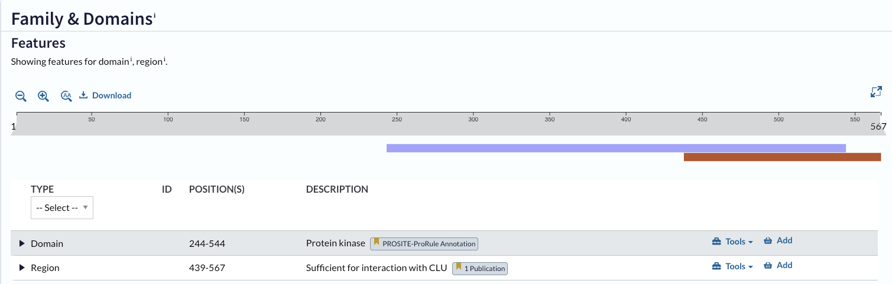
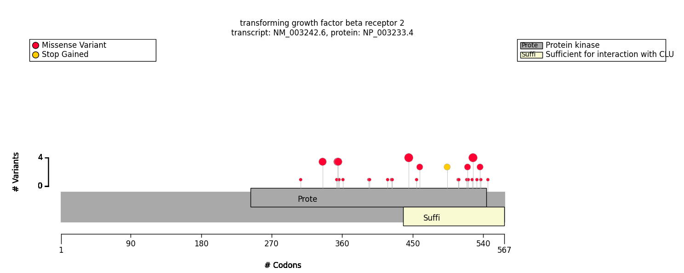
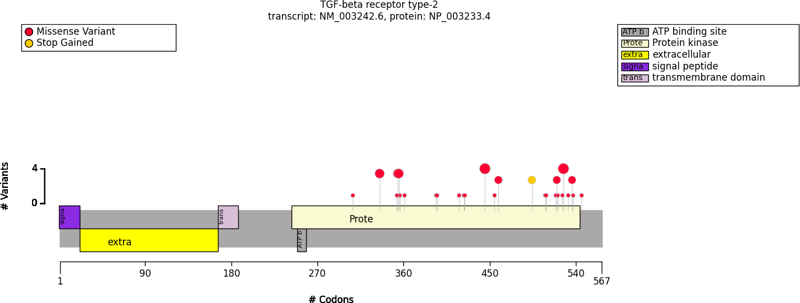

.. _protein_domains:

===============
Protein Domains
===============

Specific domains of a protein may be associated with genotype-phenotype correlations. 
For instance, variants in the pore domain of PIEZO1 are associated with more severe clinical 
manifestions in dehydrated hereditary stomatocytosis [Andolfo et al.,  2018](https://pubmed.ncbi.nlm.nih.gov/30187933/).

GPSEA supports the investigation of domain-specific correlations in several ways. By default, GPSEA leverages the 
API of [UniProt](https://www.uniprot.org/) to retrieve domain information if possible. This will retrieve information as
shown on the UniProt page for the protein in question. For instance, the following image shows a screenshot of the UniProt entry
for TGFBR2.

   Figure 1. Protein features of TGFBR2 (P37173, UniProt entry)

UniProt shows two protein features, the Protein kinase domain (244-544) and the Sufficient for interaction with CLU domain (439-567).
Using the code that is explained TODO TODO TODO TODO, GPSEA will produce the following graphic for TGFBR2 and the TGFBR2 phenopackets
in phenopacket-store release 0.1.20.

   Figure 2. GPSEA display of variants and protein features of TGFBR2

If it is not possible to use the API to retrieve this information, it is also possible to download the a JSON file representing the features of the 
entry and to load this file to create the required ``ProteinMetadata`` object. To do this, click on the Download symbol as shown in Figure 1. This will open a dialog
that allows the user to choose the contents of the JSON file. Do not change the default option (Features - Domain, Region).
Following this, it is possible to create the ``ProteinMetadata`` object as follows. Note that you will need to obtain information about the protein name (label)
and length, but these are shown in the UniProt entry.

.. code-block:: python

    from gpsea.model import ProteinMetadata
    downloaded_uniprot_json = "P37173.json"
    protein_meta =  ProteinMetadata.from_uniprot_json(
            protein_id=mane_protein_id,
            label="transforming growth factor beta receptor 2",
            uniprot_json=downloaded_uniprot_json,
            protein_length=567,
        )

Manual entry of protein domain information
^^^^^^^^^^^^^^^^^^^^^^^^^^^^^^^^^^^^^^^^^^

The information about protein features provided by UniProt entries may not always be complete. 

The UniProt entry P37173 indicates that

- signal peptide: 1-22
- extracellular: 23-166 
- transmembrane domain: 167-187.
- ATP binding site: 250-258
- Protein kinase: 244-544

To enter this information, we can use the following code.

.. code-block:: python

    import pandas as pd
    domain_list = [ {"region": "signal peptide","category": "domain", "start": 1, "end": 22, },
                {"region": "extracellular", "category": "domain", "start": 23, "end": 166, },
                {"region": "transmembrane domain", "category": "domain", "start": 167, "end": 187, },
                {"region": "ATP binding site", "category": "domain", "start": 250, "end": 258, },
                {"region": "Protein kinase", "category": "domain", "start": 244, "end": 544, },
            ]
    df = pd.DataFrame(domain_list)
    manual_protein_meta = ProteinMetadata.from_feature_frame(
                protein_id=mane_protein_id,
                label="TGF-beta receptor type-2",
                features=df,
                protein_length=567,
        )
    txc_service = VVMultiCoordinateService(genome_build=GRCh38)
    tx_coordinates = txc_service.fetch(mane_tx_id)
    pvis = ProteinVisualizable(tx_coordinates=tx_coordinates, protein_meta=manual_protein_meta, cohort=cohort)
    from gpsea.view import ProteinVisualizer
    drawer = ProteinVisualizer()
    ax = drawer.draw_fig(pvis=pvis)

This will produce the graphic shown in Figure 3.

   Figure 3. GPSEA display of variants and protein features of TGFBR2 against background of manually entered domains

In the current case, all of the pathogenic variants are located in the protein-kinase domain.